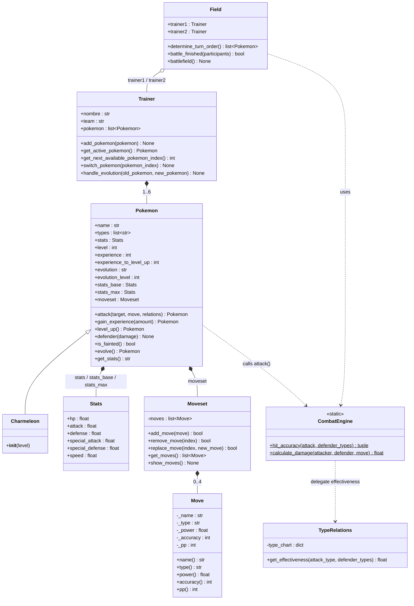

# POKE — Sistema de Combate Pokémon

Sistema didáctico de combate tipo Pokémon construido en Python 3.10+,
diseñado para ilustrar los principios fundamentales de la Programación
Orientada a Objetos (POO).

---

## Tabla de contenidos

- [Objetivos](#objetivos)
- [Principios POO aplicados](#principios-poo-aplicados)
- [Estructura de módulos y paquetes](#estructura-de-módulos-y-paquetes)
- [Diseño del sistema](#diseño-del-sistema)
- [Diagrama UML](#diagrama-uml)
- [Instrucciones de uso](#instrucciones-de-uso)
- [Contribuir](#contribuir)

---

## Objetivos

1. Modelar un sistema de combate tipo Pokémon usando los principios de POO.
2. Definir clases con responsabilidades claras y bien delimitadas.
3. Representar relaciones entre entidades (composición, agregación, herencia) mediante UML.
4. Organizar el código en módulos y paquetes reutilizables.

---

## Principios POO aplicados

### 1. Encapsulamiento

Cada clase protege su estado interno y expone solo lo necesario:

- `Move` declara todos sus atributos como privados (`_name`, `_type`, `_power`,
  `_accuracy`, `_pp`) y los expone a través de `@property`, impidiendo
  modificaciones externas accidentales.
- `Moveset` controla toda la lista interna de movimientos; la única forma de
  agregar o reemplazar un movimiento es a través de sus métodos públicos
  (`add_move`, `replace_move`, `remove_move`), que aplican la restricción de
  máximo cuatro movimientos.
- `Pokemon` mantiene copias separadas de `stats_base` y `stats_max`, de modo
  que las estadísticas actuales pueden escalar con el nivel sin perder los
  valores originales.

### 2. Abstracción

Cada clase modela únicamente los conceptos necesarios para su responsabilidad:

- `Stats` encapsula el conjunto completo de estadísticas de combate en un
  único objeto, simplificando la firma del constructor de `Pokemon`.
- `CombatEngine` abstrae toda la lógica de cálculo de daño y precisión en nuevos
  métodos.
- `TypeRelations` abstrae la tabla de efectividades de tipos en una consulta
  simple (`get_effectiveness`), ocultando la estructura interna del diccionario.

### 3. Herencia

La clase `Pokemon` actúa como clase base:

- `Charmeleon` hereda de `Pokemon` y sobrescribe nombre, tipos y estadísticas
  predeterminadas, reutilizando toda la lógica de combate y evolución del padre.


### 4. Polimorfismo

`Field.battlefield()` y `CombatEngine.calculate_damage()` reciben objetos
`Pokemon` sin conocer su subclase concreta. Cuando un `Charmander` evoluciona
a `Charmeleon` durante la batalla, el campo reemplaza la referencia en
`participants` sin cambiar ninguna otra lógica.

### 5. Composición y Agregación

- **Composición fuerte** (`*--`): `Pokemon` posee un `Stats` y un `Moveset`
  que no tienen sentido fuera del Pokémon que los contiene. Si el Pokémon es
  eliminado, sus estadísticas y moveset dejan de existir.
- **Composición fuerte** (`*--`): `Moveset` posee sus `Move`; un movimiento
  pertenece a un único Moveset.
- **Agregación** (`o--`): `Trainer` gestiona una lista de Pokémon, pero los
  Pokémon pueden existir independientemente. `Field` referencia a los dos `Trainer` sin apropiarse de ellos;
los Pokémon activos se obtienen dinámicamente durante la batalla.

---

## Estructura de módulos y paquetes

```
poke-repo/
├── src/
│   ├── __init__.py
│   ├── models/
│   │   ├── __init__.py
│   │   ├── pokemon.py       
│   │   ├── pokemon_types.py 
│   │   ├── move.py          
│   │   ├── stats.py         
│   │   └── trainer.py       
│   ├── engine/
│   │   ├── __init__.py
│   │   ├── combat_engine.py  
│   │   ├── type_relations.py 
│   │   └── field.py          
│   └── utils/
│       ├── __init__.py
│       └── constants.py      
├── tests/
│   ├── __init__.py
│   ├── test_combat_engine.py
│   ├── test_battle_flow.py
│   └── test_evolution.py
├── README.md                   
├── requirements.txt
└── main.py
```

### Responsabilidad de cada módulo

| Módulo | Responsabilidad |
|---|---|
| `models/pokemon.py` | Entidad principal: atributos, combate, evolución y ganancia de experiencia |
| `models/move.py` | Representación de movimientos y colección de hasta 4 moves |
| `models/stats.py` | Contenedor de estadísticas de combate |
| `models/trainer.py` | Gestión de equipo (hasta 6 Pokémon) y cambio de activo |
| `engine/combat_engine.py` | Cálculo de daño, comprobación de precisión |
| `engine/type_relations.py` | Tabla de efectividades entre tipos |
| `engine/field.py` | Bucle de turnos, orden de ataque, fin de batalla |
| `utils/constants.py` | Valores globales reutilizables |

---

## Diseño del sistema

### Entidades principales

| Clase | Rol |
|---|---|
| `Pokemon` | Entidad combatiente con estadísticas, moveset y lógica de evolución |
| `Stats` | Encapsula HP, ataque, defensa, velocidad y ataque especial |
| `Move` | Representa un movimiento con nombre, tipo, poder, precisión y PP |
| `Moveset` | Colección de hasta 4 movimientos con operaciones de gestión |
| `Trainer` | Gestor de equipo de hasta 6 Pokémon |
| `CombatEngine` | Lógica de cálculo de daño y verificación de impacto |
| `TypeRelations` | Tabla de multiplicadores de tipo (fuego, agua, planta…) |
| `Field` | Entorno de batalla: turnos, orden de ataque y condición de fin |

### Flujo de una batalla

```
Field.battlefield()
  └─ determine_turn_order() #se determina por velocidad, es aleatorio si hay empate
  └─ (bucle de turnos)
       ├─ attacker elige Move
       ├─ CombatEngine.calculate_damage()
       │     └─ TypeRelations.get_effectiveness()
       ├─ defender.defender(damage)
       ├─ attacker.gain_experience()  
       │     └─ level_up()
       │           └─ evolve()        
       └─ Trainer.switch_pokemon() # solo si defender.is_fainted() 
```

---

## Diagrama UML del proyecto:




### Notación utilizada

| Símbolo | Significado |
|---|---|
| `*--` | Composición — la parte no existe sin el todo |
| `o--` | Agregación — la parte puede existir de forma independiente |
| `-->` | Dependencia — una clase usa otra sin poseerla |
| `<\|--` | Herencia — la subclase extiende la superclase |
| `<<static>>` | La clase no se instancia; sus métodos son estáticos |
| `-` prefijo | Atributo o método privado |
| `+` prefijo | Atributo o método público |

---

## Instrucciones de uso

### Requisitos previos

- Python 3.10 o superior
- Administrador de paquetes de Python **`uv`** instalado en el sistema

### Instalación y Configuración

1. Primero debemos clonar el repositorio y navega a la carpeta del proyecto:
```bash
git clone https://github.com/fegonzalez7/poo-2026-1.git
cd poo-2026-1
```

2. Como segundo paso, se crea el entorno virtual aislado utilizando `uv`:
```bash
uv venv
```

3. Luego, se instala las dependencias lógicas del proyecto y las herramientas de desarrollo (`pytest`, `ruff`, `mypy`):
```bash
uv pip install -r requirements.txt
uv pip install pytest mypy ruff
```

### Ejecutar la simulación

Para iniciar el simulador de combate Pokémon, ejecuta el script principal a través del entorno virtual:
```bash
uv run python main.py
```

Durante la ejecución, el juego pedirá por consola qué movimiento usar en cada turno y si deseas continuar, cambiar de Pokémon o rendirte.

### Ejecutar los tests

Para validar que los componentes y la lógica funcionen correctamente:
```bash
uv run python -m pytest
```

### Aseguramiento de Calidad 

El proyecto utiliza un pipeline estricto para validar el formato y el tipado, este se puede comprobar localmente con:

- **Verificación de Estilo y Formato (Ruff):**
  ```bash
  uv run ruff format --check .
  uv run ruff check .
  ```

- **Verificación de Tipado Estático (Mypy):**
  ```bash
  uv run mypy .
  ```
